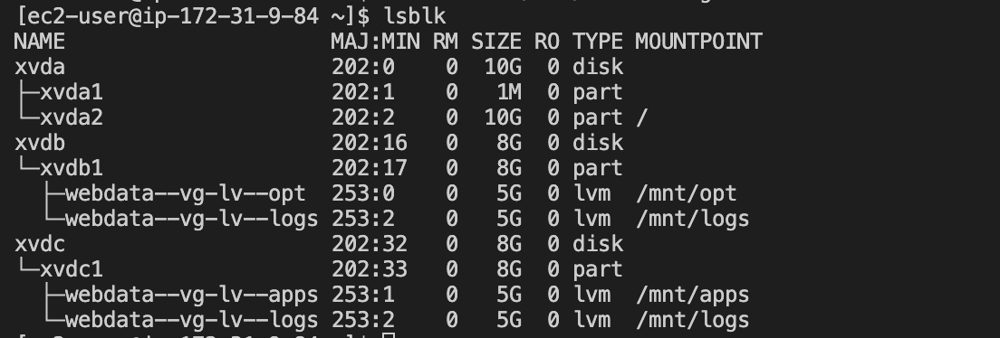
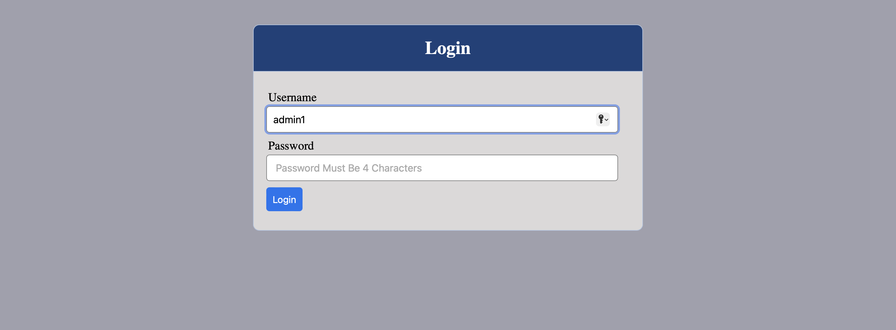
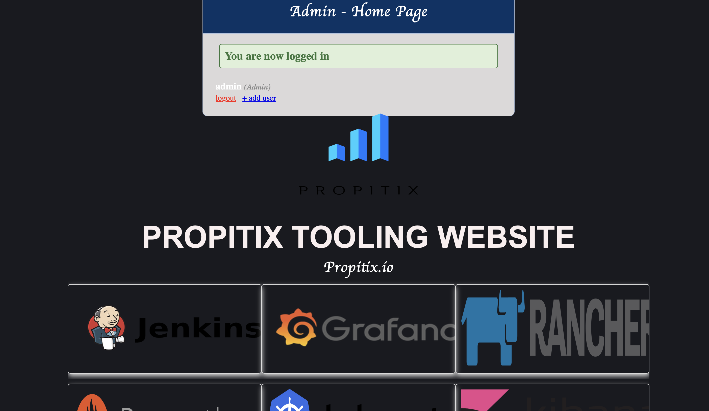

# Project-7
**DEVOPS TOOLING WEBSITE SOLUTION**


# STEP 1 - PREPARE NFS SERVER

- Spin up a new EC2 instance with RHEL Linux 8 Operating System

- Configure LVM on the Server

- Use gdisk utility to create a single partition on each of the  disks

`sudo gdisk /dev/xvdb`

`sudo gdisk /dev/xvdc`

- Install lvm2 package 

`sudo yum install lvm2`

- Use pvcreate utility to mark each of  disks as physical volumes (PVs) to be used by LVM

```
sudo pvcreate /dev/xvdb1
sudo pvcreate /dev/xvdc1
```

- Use vgcreate utility to add all  PVs to a volume group (VG). Name the VG webdata-vg

`sudo vgcreate webdata-vg /dev/xvdb1 /dev/xvdc2`

- Use lvcreate utility to create 3 logical volumes. lv-opt, lv-apps, lv-logs (Share the PV SIZE equally)

```
sudo lvcreate -n lv-opt -L 5G webdata-vg
sudo lvcreate -n lv-apps -L 5G webdata-vg
sudo lvcreate -n lv-logs -L 5G webdata-vg
```

- Verify the entire setup

```
sudo vgdisplay -v #view complete setup - VG, PV, and LV
sudo lsblk
```

- Use mkfs.xfs to format the logical volumes with xfs filesystem

```
sudo mkfs -t xfs /dev/webdata-vg/lv-opt
sudo mkfs -t xfs /dev/webdata-vg/lv-apps
sudo mkfs -t xfs /dev/webdata-vg/lv-logs
```

- Create mount points on /mnt directory for the logical volumes as follow:
Mount lv-apps on /mnt/apps – To be used by webservers
Mount lv-logs on  /mnt/logs – To be used by webserver logs
Mount lv-opt on  /mnt/opt – To be used by Jenkins server in Project 8

`sudo mkdir /mnt/opt /mnt/apps /mnt/logs`

```
sudo mount /dev/webdata-vg/lv-apps /mnt/apps
sudo mount /dev/webdata-vg/lv-opt /mnt/opt
sudo mount /dev/webdata-vg/lv-logs /mnt/logs
```



- Update /etc/fstab file so that the mount configuration will persist after restart of the server.

`sudo vi /etc/fstab`


- Test the configuration and reload the daemon

```
sudo mount -a
sudo systemctl daemon-reload
```

- Verify your setup by running `df -h`, output must look like this


- Install NFS server, configure it to start on reboot and make sure it is up and running

```
sudo yum -y update
sudo yum install nfs-utils -y
sudo systemctl start nfs-server.service
sudo systemctl enable nfs-server.service
sudo systemctl status nfs-server.service
```


- Export the mounts for webservers’ subnet cidr to connect as clients. For simplicity, you will install your all three Web Servers inside the same subnet, but in production set up you would probably want to separate each tier inside its own subnet for higher level of security.


- set up permission that will allow our Web servers to read, write and execute files on NFS:

```
sudo chown -R nobody: /mnt/apps
sudo chown -R nobody: /mnt/logs
sudo chown -R nobody: /mnt/opt

sudo chmod -R 777 /mnt/apps
sudo chmod -R 777 /mnt/logs
sudo chmod -R 777 /mnt/opt

sudo systemctl restart nfs-server.service
```

- Configure access to NFS for clients within the same subnet 

```
sudo vi /etc/exports

/mnt/apps <Subnet-CIDR>(rw,sync,no_all_squash,no_root_squash)
/mnt/logs <Subnet-CIDR>(rw,sync,no_all_squash,no_root_squash)
/mnt/opt <Subnet-CIDR>(rw,sync,no_all_squash,no_root_squash)
```

- Refresh and export all NFS  shares listed in the /etc/exports file.

`sudo exportfs -arv`


- Check which port is used by NFS and open it using Security Groups (add new Inbound Rule)

`rpcinfo -p | grep nfs`


- **NB: In order for NFS server to be accessible from your client, you must also open following ports: TCP 111, UDP 111, UDP 2049**


# STEP 2 — CONFIGURE THE DATABASE SERVER

- Spin up a new EC2 instance with UBUNTU 20.0.4 OS

- Install MySQL server

`sudo apt update`
`susdo apt install mysql-server`
`sudo systemctl status`
`sudo mysql`

- Create a database and name it tooling

`create database tooling;`

- Create a database user and name it webaccess

` create user 'webaccess'@'%' identified with mysql_native_password by 'password'; `

- Grant permission to webaccess user on tooling database to do anything only from the webservers subnet cidr

` GRANT ALL privileges on toolingG.* to 'webaccess'@'%'`;

`FLUSH privileges`
`exit`

- edit bind address to (bind-address = 0.0.0.0
) to be able to connect MySQL from any server

`sudo nano /etc/mysql/mysql.conf.d/mysqld.cnf`


# Step 3 — Prepare the Web Servers

- We need to make sure that our Web Servers can serve the same content from shared storage solutions, in this case – NFS Server and MySQL database
- As already known, one DB can be accessed for reads and writes by multiple clients.
For storing shared files that our Web Servers will use – we will utilize NFS and mount previously created Logical Volume **lv-apps** to the folder where Apache stores files to be served to the users (/var/www).
- This approach will make our Web Servers stateless, which means we will be able to add new ones or remove them whenever we need, and the integrity of the data (in the database and on NFS) will be preserved.

During the next steps, the following will be done:

- Configure NFS client (this step must be done on all three servers)
- Deploy a Tooling application to our Web Servers into a shared NFS folder
- Configure the Web Servers to work with a single MySQL database

- open TCP port 80 on the Web Server

1. Launch a new EC2 instance with RHEL 8 Operating System

2. Install NFS client

`sudo yum install nfs-utils nfs4-acl-tools -y`

3. Mount /var/www/ and target the NFS server’s export for apps

```
sudo mkdir /var/www
sudo mount -t nfs -o rw,nosuid <NFS-Server-Private-IP-Address>:/mnt/apps /var/www
```

4. Verify that NFS was mounted successfully by running df -h. Make sure that the changes will persist on Web Server after reboot:

`sudo vi /etc/fstab`

`<NFS-Server-Private-IP-Address>:/mnt/apps /var/www nfs defaults 0 0`

5. Install Remi’s repository, Apache and PHP

```
sudo yum install httpd -y

sudo dnf install https://dl.fedoraproject.org/pub/epel/epel-release-latest-8.noarch.rpm

sudo dnf install dnf-utils http://rpms.remirepo.net/enterprise/remi-release-8.rpm

sudo dnf module reset php

sudo dnf module enable php:remi-7.4

sudo dnf install php php-opcache php-gd php-curl php-mysqlnd

sudo systemctl start php-fpm

sudo systemctl enable php-fpm

setsebool -P httpd_execmem 1
```


- **Repeat steps 1-5 for another 2 Web Servers.** ( Refer to the the bash script **nfs.sh**)


- **Imporant note about the `setsebool -P httpd_execmem 1` command;**
SELinux is a security module in Linux that provides mandatory access control (MAC) for processes and files on the system. The httpd_execmem boolean is used to control whether the httpd service is allowed to execute code in memory that is marked as writable or executable. By default, this boolean is set to "off" for security reasons. However, in some cases, such as when running certain web applications, it may be necessary to allow the httpd service to execute code in memory that is marked as writable or executable.

So, when you run the "setsebool -P httpd_execmem 1" command, you set the httpd_execmem boolean to "on", which allows the httpd service to execute code in memory that is marked as writable or executable. This may be necessary in certain situations, but should be done with caution as it may weaken the security of the system.


6. Verify that Apache files and directories are available on the Web Server in /var/www and also on the NFS server in /mnt/apps. If you see the same files – it means NFS is mounted correctly. You can try to create a new file touch test.txt from one server and check if the same file is accessible from other Web Servers.


7. Fork the tooling source code from [Darey.io Github Account](https://github.com/darey-io/tooling) to your Github account.


`sudo yum install git`

`sudo git clone https://github.com/darey-io/tooling`


`ls && cd tooling`


8. Deploy the tooling website’s code to the Webserver. Ensure that the html folder from the repository is deployed to /var/www/html

`sudo mv tooling/* .`

`sudo mv html/* .`


9. Update the website’s configuration to connect to the database in (/var/www/html/functions.php .

`sudo vi funtions.php`


- install mysql on the webserver

`sudo yum install mysql-server`

Apply tooling-db.sql script to your database

`mysql -u webaccess -ppassword -h 172.31.43.42 tooling < tooling-db.sql`

- connect to mysql Database server

`mysql -u webaccess -ppassword -h 172.31.43.42 tooling`

`show databases;`


`select * from users;`

- Disable SELinux 

`sudo setenforce 0`

- To make this change permanent – open following config file

`sudo vi /etc/sysconfig/selinux`

- and set SELINUX=disabled , then restart httpd

`sudo systemctl restart httpd`

`sudo systemctl start httpd`

`sudo systemctl enable httpd`

11. Open the website in your browser

`http://<Web-Server-Public-IP-Address-or-Public-DNS-Name>/index.php`
and make sure you can login into the websute with *myuser* user.






# You have just implemented a web solution for a DevOps team using LAMP stack with remote Database and NFS servers

# **THANK YOU !!!**


